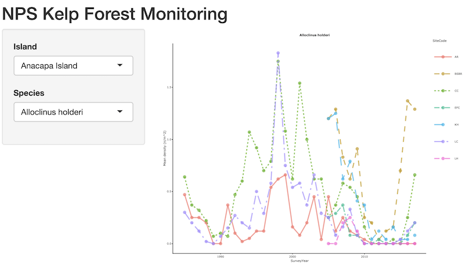

# nps-kelp

National Park Service Kelp Forest Monitoring visualization

## Application

You can check out the initial [Shiny](http://shiny.rstudio.com) app here:

[ecoquants.shinyapps.io/nps-kelp](https://ecoquants.shinyapps.io/nps-kelp/)

[](https://ecoquants.shinyapps.io/nps-kelp/)

### Run Locally

You can also run it locally in your own version of [R](https://cran.r-project.org/) with the following command:

```r
shiny::runGitHub("ecoquants/nps-kelp", subdir="app")
```

You may need to first run `install.packages("package_name")` on  packages not yet installed that are loaded at the beginning of the [`global.R`](https://github.com/ecoquants/nps-kelp/blob/master/app/global.R#L1-L6).